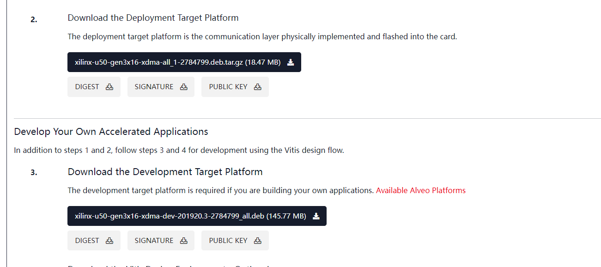

# Vitis_workflow
本教程主要介绍利用vitis工具流使用，如图所示是vitis工具流的概览。

FPGA：  ZCU104、Alevo U50

系统：  ubuntu18.04


## 1 教程目录

1. [overall](./overall/README.md)：整体加速器部署流程简介，并给出一个简单样例作为参考。[跳转链接](./overall/README.md)

2. [multi-kernels](./multi-kernels/README.md)：加速器多核部署方案样例，涉及单核多部署，多核单部署以及多核多部署。[跳转链接](./multi-kernels/README.md)


3. [host](./host/README.md)：vitis加速应用的上层控制代码编写。[跳转链接](./host/README.md)

4. [Makefile](./Makefile/README.md)：vitis工具流编译文件规则，一键式部署方案设计。[跳转链接](./Makefile/README.md)

5. [examples](./example/fft/README.md)：加速器部署样例以及编译运行脚本，涉及到在完成加速器设计之后将硬件设计部署到板卡或模拟器的编译过程。


## 2 环境准备

### 2.1 安装所需依赖
```
sudo apt-get install ocl-icd-libopencl1 opencl-headers ocl-icd-opencl-dev
sudo add-apt-repository ppa:xorg-edgers/ppa 
sudo apt-get update
sudo apt-get install libgl1-mesa-glx
sudo apt-get install libgl1-mesa-dri
sudo apt-get install libgl1-mesa-dev
sudo add-apt-repository --remove ppa:xorg-edgers/ppa
sudo apt install net-tools
sudo apt-get install -y unzip
sudo apt install gcc
sudo apt install g++
sudo apt install python
ln -s /usr/bin/python2 /usr/bin/python
sudo apt install putty
curl -1sLf \
   'https://dl.cloudsmith.io/public/balena/etcher/setup.deb.sh' \
   | sudo -E bash
sudo apt-get update
sudo apt-get install balena-etcher-electron
```
### 2.2 下载安装vitis相关工具

1. [安装vitis软件](https://www.xilinx.com/support/download/index.html/content/xilinx/en/downloadNav/vitis.html)，这里下载的版本号最好要与之后下载相关内容保持一致。
	例如：这里下载了vitis2020.2，后续的软件和镜像最好也下载2020.2或者之前版本以保证兼容性。

2. [安装XRT软件](https://www.xilinx.com/products/design-tools/vitis/xrt.html#gettingstarted)，XRT是Xilinx FPGA的运行时库。

3. 配置环境
```
source /tools/Xilinx/Vitis/2020.2/settings64.sh
source /tools/Xilinx/Vitis_HLS/2020.2/settings64.sh
source /opt/xilinx/xrt/setup.sh
```

4. 平台描述文件下载

    +   ZCU104

        - [下载ZCU104平台描述文件](https://www.xilinx.com/support/download/index.html/content/xilinx/en/downloadNav/embedded-platforms.html)，解压ZCU104平台描述文件，并将其复制到 `/opt/xilinx/platforms/` 下。

	        ps：对于这里使用vitis 2020.2版本的同学来说，请选择2020.1版本的ZCU104平台描述文件。

	        pss：2020.2版本的平台描述文件没有包含opencl domain，无法使用xrt方式运行并对PL编程。

        - [下载ZYNP平台通用镜像并解压](xilinx.com/support/download/index.html/content/xilinx/en/downloadNav/embedded-platforms/archive-vitis-embedded.html)，选择ZYNQMP common image。

        

        - ZYNP平台通用镜像展开，经过这个步骤，获得后续进行工程的镜像和文件树等内容。
            ```
            cd xilinx-zynqmp-common-v2020.2/
            sudo gunzip ./rootfs.ext4.gz
            ./sdk.sh -y -dir ./ -p
            ```

    + Alveo U50

        - [下载U50平台描述文件](https://www.xilinx.com/products/boards-and-kits/alveo/u50.html#gettingStarted)并安装。

        - [下载U50物理层通信驱动](https://www.xilinx.com/products/boards-and-kits/alveo/u50.html#gettingStarted)并安装。

        
