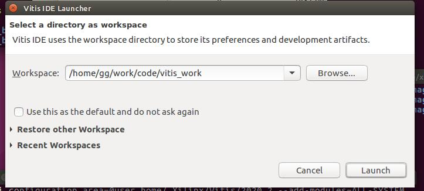
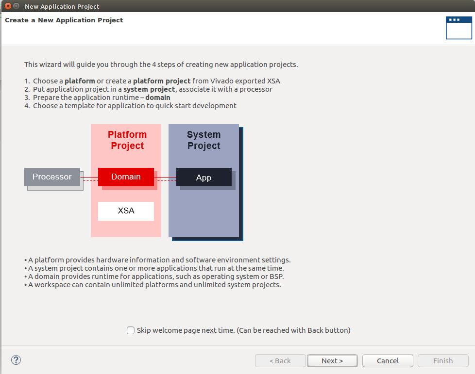
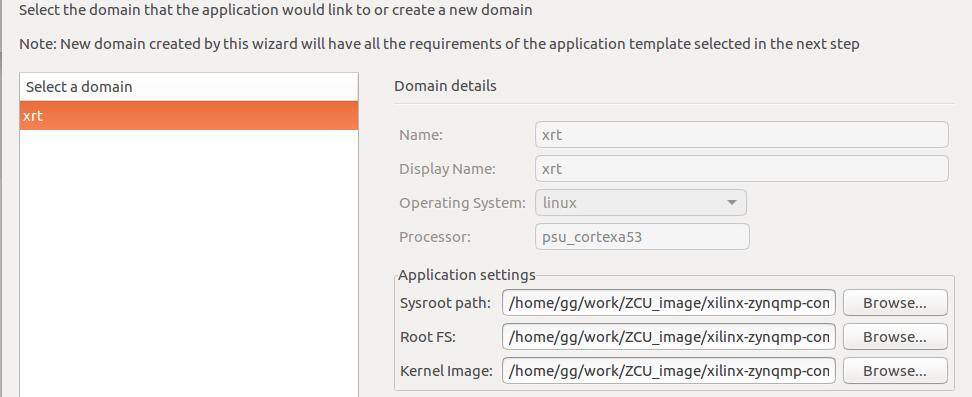
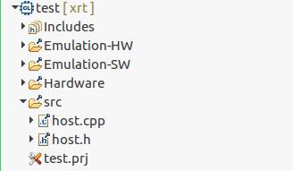
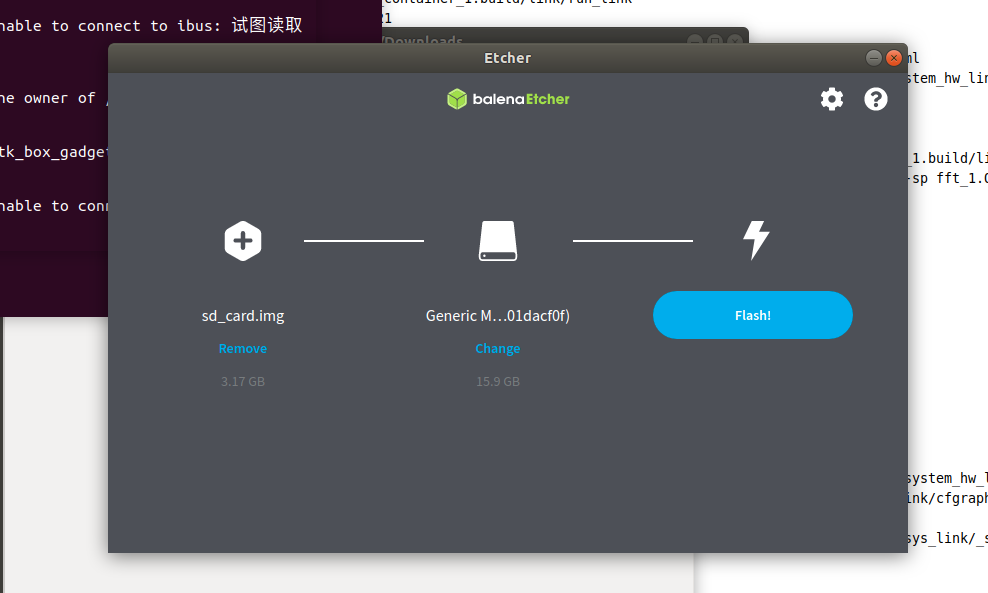
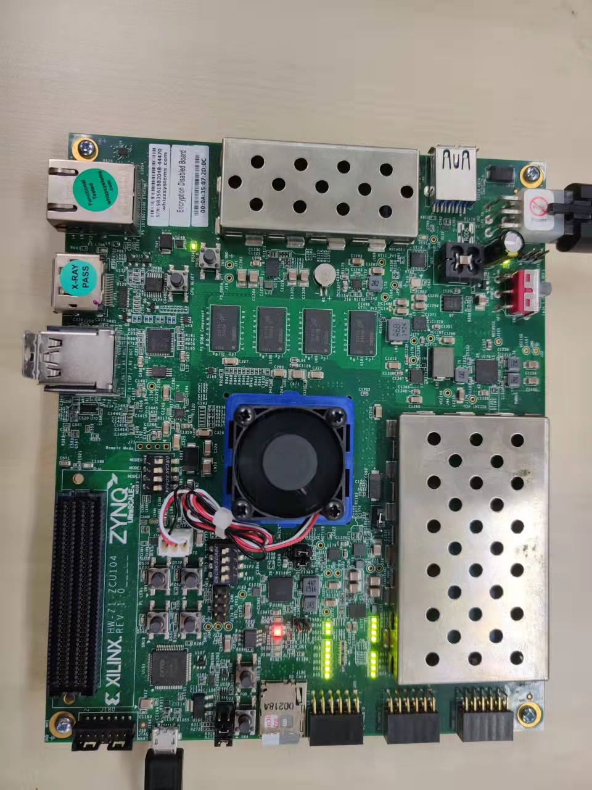
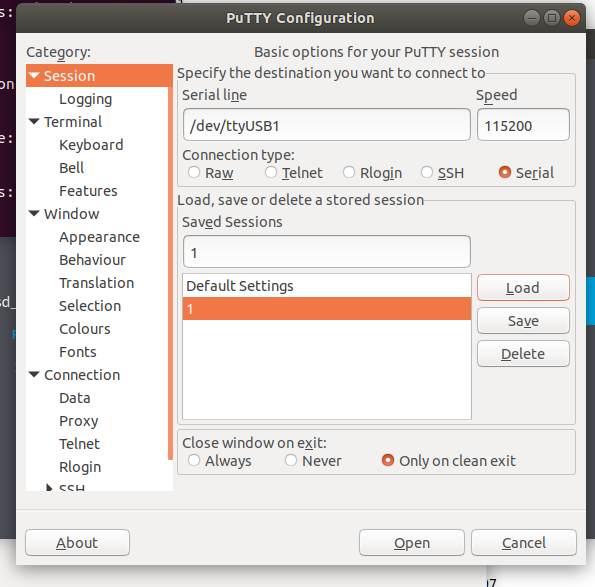

# ZCU104板卡加速器部署示例

## 1 应用工程创建

### 1.1 建立工程
1. 在终端直接运行`vitis`，设置工作目录



2. 新建应用工程，并点击next



3. 点击Add添加之前已经下载好的ZCU104平台描述文件


4. 输入应用名称，例如 test


5. 选择镜像文件
	+ Sysroot 		-> /ZYNP平台通用镜像路径/xilinx-zynqmp-common-v2020.2/ir/sysroots/aarch64-xilinx-linux
	+ Root FS 		-> /ZYNP平台通用镜像路径/xilinx-zynqmp-common-v2020.2/rootfs.ext4
	+ Kernel Image 	-> /ZYNP平台通用镜像路径/xilinx-zynqmp-common-v2020.2/Image



6. 创建空白应用工程，选择Empty Application后点击Finish


### 1.2 kernel端配置

1. 添加kernel代码，将编写好的kernel代码复制或导入到如图的src文件夹内


2. 打开上图中的test_kernels.prj配置kernel信息

3. 注册kernel函数，点击Add Hardware Fuction，添加硬件单元的TOP函数


4. 可选配置

	+ 设置kernel编译时频率约束
		- 在Assistant界面右键kernel项目部分
		- 单击Settings进入编译设置界面
		- 在kernel目录下的Hardware中选中$YOUR_KERNEL_NAME选项
		- 在v++ compiler options中添加`--hls.clock 300000000:$YOUR_KERNEL_NAME`，其中300000000代表300MHz


	+ 关联vitis_hls软件，工程编译以后可用
		- 打开之前的test_kernels.prj页面
		- 单击下图选中的图标快速打开hls软件调试kernel代码


### 1.3 host端配置

1. 添加host代码，将编写好的host代码复制或导入到如图的src文件夹内



### 1.4 HW-link配置

1. 打开图中的test_system_hw_link.prj配置link信息
2. 点击Add Binary Container创建一个容器
3. 点击ADD Hardware Fuction添加硬件单元的Top Fuction


4. 可选配置

	+ 设置硬件实现频率约束
		- 在Assistant界面右键hw_link项目部分
		- 单击Settings进入编译设置界面
		- 在hw_link目录下的Hardware中选中$YOUR_CONTAINER_NAME选项
		- 在v++ compiler options中添加`--clock.defaultFreqHz 300000000`，其中300000000代表300MHz

	+ 设置kernel端口映射
		- 在下图中的Memory选项中可以配置kernel的端口映射信息

        
        
	+ 关联vivado软件，工程编译以后可用
		- 在Assistant界面右键hw_link项目下的container部分
		- 单击Open Vivado Project进入vivado工程快速调试
		


## 2 应用工程编译

在Explorer界面选中System后，便可在菜单中点击build按钮，其中编译分为三种模式
+ Emulation-SW：软件仿真，类似于hls的纯软件仿真，主要是用于验证算法的正确性
+ Emulation-HW：硬件仿真，仿真真实的硬件连接，用于检查硬件链接问题以及内存访问问题
+ Hardware：硬件实现，编译可用于FPGA硬件的工程文件


## 3 硬件部署

### 3.1 SD卡烧录

1. 将sd卡插到电脑
2. 打开etcher软件
3. 在软件中的image选项里选择，`/PATH-to-YOUR-WORK/test_system/Hardware/package`下找到sd_card.img文件
4. 在device选项里选择sd卡
5. 单击Flash进行烧录



### 3.2 ZCU104板卡串口连接

1. 将ZCU104板卡与主机连接，并插上之前已经烧录好的sd卡



2. 命令行运行`sudo putty`，打开putty后并如图配置，串口号随实际情况变化，本案例里是`ttyUSB1`



## 4 运行结果

1. 板卡上电运行
2. 启动后运行如下命令

```
cd /mnt/sd-mmcblkOp1/
source ./init.sh
```

3. 执行host程序

```
./test --xclbin ./binary_container_1.xclbin
```